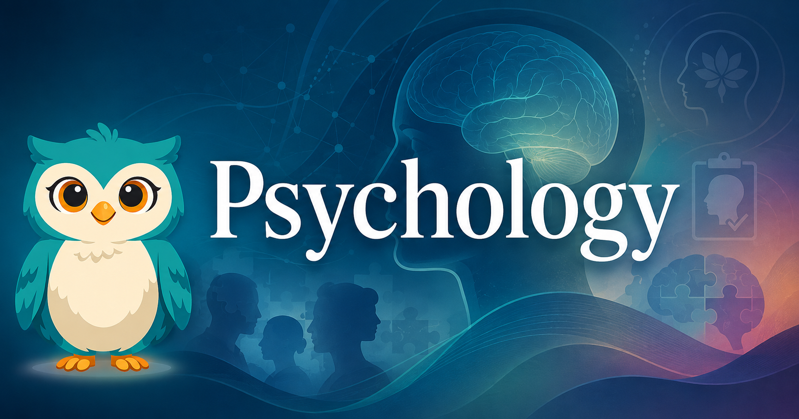

# Psychology

<figure markdown>
  { width="100%" }
</figure>

Welcome to **Psychology** — a comprehensive intelligent textbook exploring human thought, emotion, development, and behavior through interactive simulations and guided learning.

## About This Book

This AP-level textbook covers all major areas of psychology — from biological bases of behavior and sensation/perception through developmental psychology, social influence, and psychological disorders. Each chapter pairs research-grounded content with interactive MicroSims and guided concept maps to deepen understanding.

## Who This Book Is For

- High school students (grades 11–12) preparing for the AP Psychology exam
- Students seeking a rigorous introduction to psychological science
- Teachers looking for a freely adaptable, standards-aligned resource

## How to Use This Book

Use the navigation sidebar to explore:

- **Chapters** — main educational content organized by AP topic area
- **Learning Graph** — interactive visualization of how concepts depend on each other
- **MicroSims** — hands-on simulations for key concepts
- **Glossary** — key terms and definitions

## Getting Started

Start with [Chapter 1: Foundations & Research Methods](chapters/01-foundations-research-methods/index.md) to begin your learning journey.
