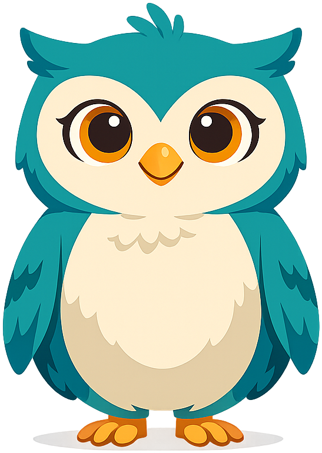
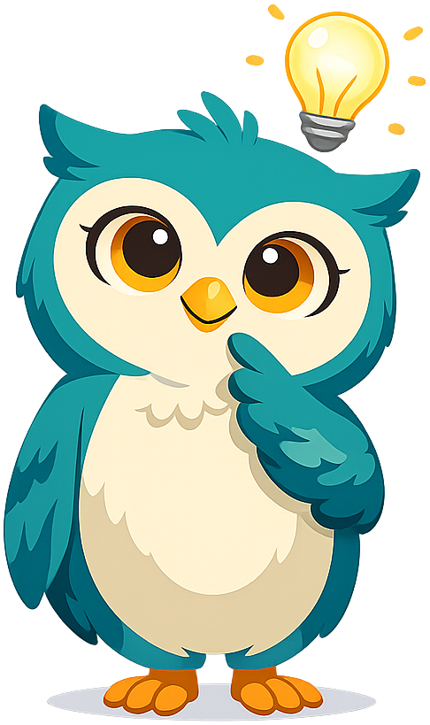
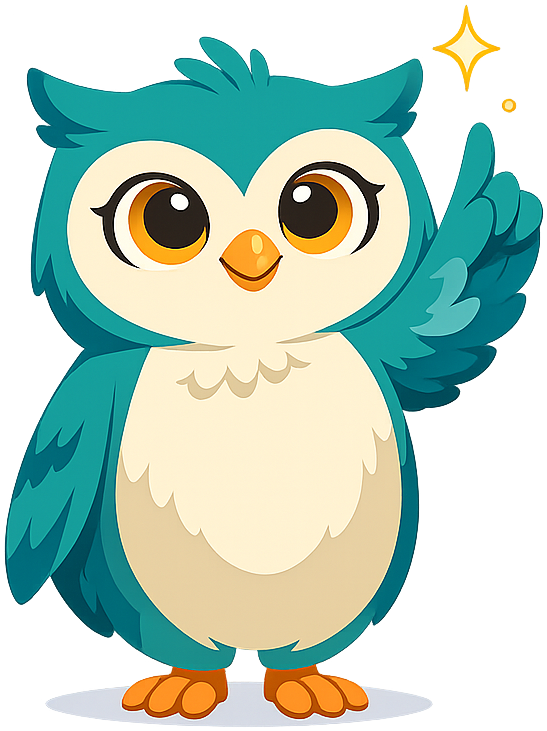
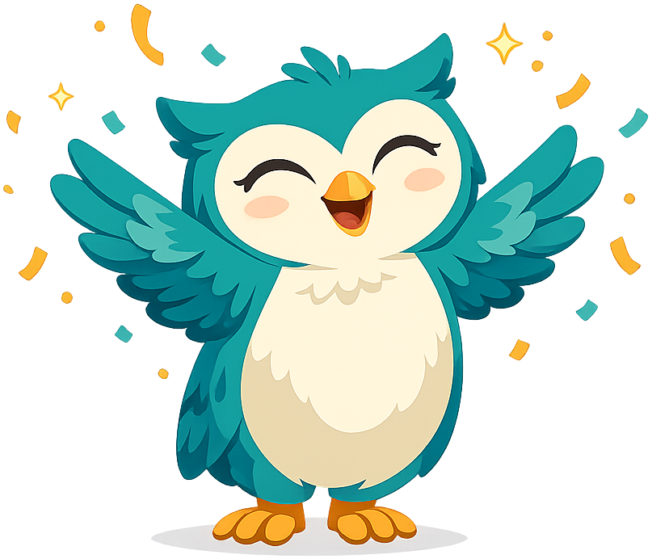

# Psy the Owl — Mascot Style Guide

This page shows all mascot admonition styles. Use it to verify that images
load correctly, colors render as expected, and text wraps cleanly around
the mascot at the configured 90px size.

Image path depth from this page: `../../img/mascot/` (page renders at
`learning-graph/mascot-test/index.html`).

---

!!! mascot-neutral "A Note from Psy"
    
    This is the **neutral** style — used for general sidebars, brief
    asides, or any content that doesn't call for a specific emotional tone.

!!! mascot-welcome "Welcome!"
    
    This is the **welcome** style — used at the opening of every chapter
    to introduce the learning goals and set the tone. *"Let's think about that!"*

!!! mascot-thinking "Key Insight"
    
    This is the **thinking** style — used to highlight key concepts,
    important connections, or moments worth slowing down to absorb.

!!! mascot-tip "Psy's Tip"
    
    This is the **tip** style — used for study hints, memory tricks,
    and practical strategies for the AP exam.

!!! mascot-warning "Watch Out!"
    
    This is the **warning** style — used to flag common misconceptions,
    frequently confused concepts, or pitfalls on the AP exam.

!!! mascot-encourage "You've Got This!"
    
    This is the **encourage** style — used when content is challenging
    or when a topic touches on sensitive mental health themes that may
    feel personal. *"Fascinating, right?"*

!!! mascot-celebration "Well Done!"
    
    This is the **celebration** style — used at chapter ends and after
    mastering a difficult concept. *"You've got this!"*

---

## Checklist

After placing mascot images in `docs/img/mascot/`, verify:

- [ ] All 7 images load (no broken image icons)
- [ ] Images are approximately 90px square inside each admonition
- [ ] Text wraps cleanly to the right of each image
- [ ] Title bar colors match the table in `docs/css/mascot.css`
- [ ] Celebration admonition has dark body (purple) so confetti is visible
- [ ] No excessive transparent padding (run trim script if needed)

## Trim Padding Command

```bash
python $BK_HOME/src/image-utils/trim-padding-from-image.py docs/img/mascot/neutral.png
python $BK_HOME/src/image-utils/trim-padding-from-image.py docs/img/mascot/welcome.png
python $BK_HOME/src/image-utils/trim-padding-from-image.py docs/img/mascot/thinking.png
python $BK_HOME/src/image-utils/trim-padding-from-image.py docs/img/mascot/tip.png
python $BK_HOME/src/image-utils/trim-padding-from-image.py docs/img/mascot/warning.png
python $BK_HOME/src/image-utils/trim-padding-from-image.py docs/img/mascot/encouraging.png
python $BK_HOME/src/image-utils/trim-padding-from-image.py docs/img/mascot/celebration.png
```
